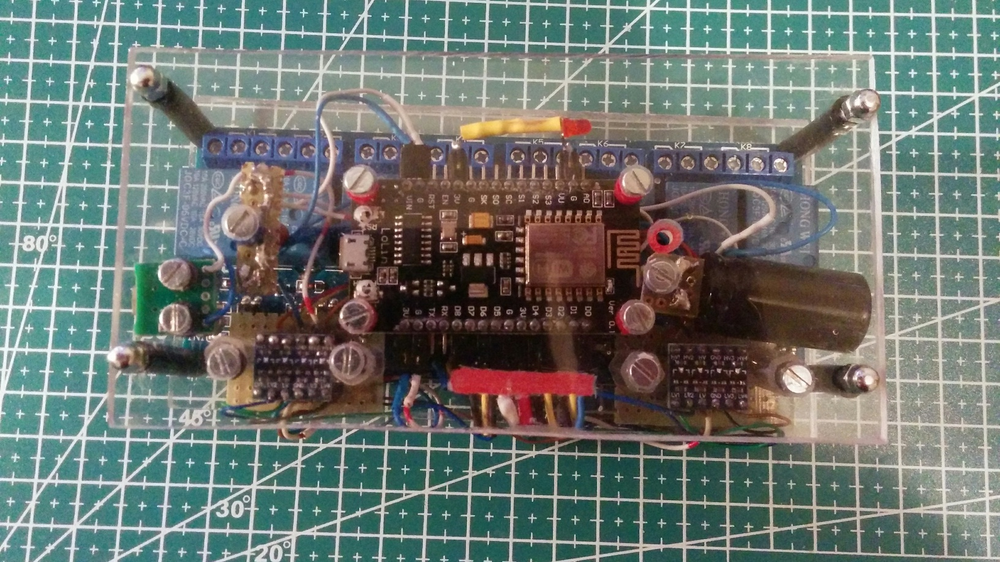

Description:
============

This C++11 program is part of an appliance to pilot an opto-insulated 8 relays array board using NodeMCU 1.0 (ESP-12E) Module. 



Hardware:
=========


I improvised the hardware using these parts I have available / recycled :

- a Wemos Lolin NodeMcu v3 module: it's a Arduino compatible platform, with embedded WIFI controller;
- an 8 relays board

- a 5V -> 3.3V logic adapters;
- other spare parts (connectors, USB plug, capacitors, etc);

DISCLAIMER:
===========

Electricity is dangerous: switching high voltage current (i.e 110/220 AC ) could cause damages and/or injuries. If you don't know what are you doing , don't try this at home.

Prerequisites:
==============

The program is compiled using Arduino IDE, version 1.8.12 (OsX version) and it's tested using the same IDE and the hardware specified in the previous paragraph. 

Installation:
=============

- Import the source code in an Arduino IDE with, at least, the specified version;
- Set the proper serial port in Tools -> Port submenu;
- Compile and Upload the program using the "upload" IDE button;
- Open the serial monitor than press the reset button on the board;
- The base URL will be printed on the serial console;

Use:
====

At the and of the installation procedure, you get the base URL, something like:

 ```shell
 http://192.168.0.1/
 ```
I suggest to reserve that IP for this use, configuring properly your router, so you haven't to connect the serial console if a different IP is negotiated.

Starting from that URL, you can set the status of all relays at once using an URL like this one:
 1. all relays at once:<BR>
 ```shell
 http://192.168.0.1/set/00000000
 ```
the sequence of 8 zeros menans that you are switching off all the relays:
 ```shell
 http://192.168.0.1/set/10000001
 ```
now the first and the eighth relay are on.
 2. a single relay specifying two digit: [0-1]  to decalre the status (off/on), [1-8] to declare the array. Example:<BR>
 ```shell
 http://192.168.0.1/set/18
 ```
 activates  the eighth relay. 

 ```shell
 http://192.168.0.1/set/18
 ```
 deactivates the eighth relay.

You can also get the current board status using:

 ```shell
 http://192.168.1.168/set/status
 ```
it returns a cvs string describing relays staatus:

 ```shell
1:0:0:1:0:0:0:0:
 ```
